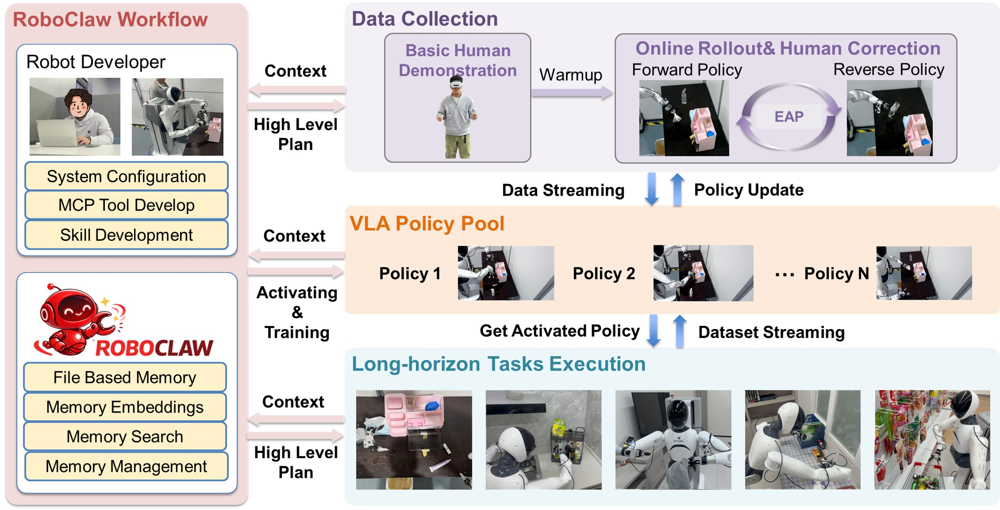

#  RoboClaw: An Agentic Framework for Scalable Long-Horizon Robotic Tasks

<p align="center">
  <a href="https://roboclaw-agibot.github.io/">
    
  </a>
  <a href="assets/paper.pdf">
    
  </a>
  
  
</p>

**[Website](https://roboclaw-agibot.github.io/) | [Paper PDF](assets/paper.pdf)**

RoboClaw is an agentic robotics framework for long-horizon manipulation. It uses a vision-language model as the high-level controller and keeps the same agent in the loop during data collection, policy learning, and deployment.

Instead of treating those stages as separate systems, RoboClaw lets the agent reason over context, choose skills, monitor execution, and feed deployment experience back into training.



> Current repository scope: this repo currently contains the paper PDF and project assets. The public code release is planned before **March 31, 2026**.

## ✨ Highlights
- One agent loop across collection, training, and deployment
- Vision-language reasoning for subtask selection and execution monitoring
- **Entangled Action Pairs (EAP)** for self-resetting data collection
- Failure recovery through retrying, replanning, or human escalation when needed
- Real-world evaluation on long-horizon manipulation tasks with the Agibot G01 platform

## 📊 Main Results
- On long-horizon tasks, RoboClaw improves success rate by **25%** over baseline pipelines
- Across the full robot lifecycle, it reduces human time investment by **53.7%**
- For the same amount of collected data, a manual pipeline requires about **2.16x** more human time
- During rollout, the manual baseline needs about **8.04x** more human intervention
- Forward policy success rates improve steadily across all four tested subtasks as rollout iterations increase

## 🧠 What RoboClaw Does
RoboClaw keeps the robot inside a single closed loop:

- During data collection, the agent observes the scene, selects the current subtask, and triggers policy execution through MCP-style tools
- For each manipulation skill, RoboClaw pairs a forward behavior with an inverse reset behavior through **Entangled Action Pairs (EAP)**, enabling self-resetting collection loops
- During deployment, the same agent monitors progress, switches skills when needed, retries or replans after failures, and escalates to humans only when recovery is unreliable or safety constraints are reached
- Execution trajectories are fed back into training, so deployment also becomes a source of new experience

## 🧪 Experimental Scenarios
We evaluate RoboClaw in several real-world settings:

- bedroom vanity table organization
- kitchen shelf organization
- study desk organization
- convenience-store shelf retrieval

The single-skill evaluations cover four representative manipulation tasks:

- body lotion placement
- primer placement with drawer closing
- lipstick insertion
- tissue wipe

## 📁 Repository Layout
```text
RoboClaw/
   README.md
   assets/
      logo.png
      paper.pdf
      teaser.jpg
```

## 📄 Paper
- Title: *RoboClaw: An Agentic Framework for Scalable Long-Horizon Robotic Tasks*
- Website: [https://roboclaw-agibot.github.io/](https://roboclaw-agibot.github.io/)
- PDF: [assets/paper.pdf](assets/paper.pdf)

## 🚧 Open-Source Release
The public codebase is being prepared for release before **March 31, 2026**.

The planned release will include:
- agent orchestration code
- EAP-based data collection pipeline
- training and evaluation scripts
- configuration files and example assets for reproducing the paper setup

If you need details before the code is public, contact the corresponding author at `wangwenhao@agibot.com`, `muyao@sjtu.edu.cn`.

## 📚 Citation
If RoboClaw is useful for your research, please cite: 

```bibtex
@misc{li2026roboclaw,
  title={RoboClaw: An Agentic Framework for Scalable Long-Horizon Robotic Tasks},
  author={Ruiying Li and Yunlang Zhou and YuYao Zhu and Kylin Chen and Jingyuan Wang and Sukai Wang and Kongtao Hu and Minhui Yu and Bowen Jiang and Zhan Su and Jiayao Ma and Xin He and Yongjian Shen and Yangyang and Guanghui Ren and Maoqing Yao and Wenhao Wang and Yao Mu},
  year={2026},
  eprint={2603.11558},
  archivePrefix={arXiv},
  primaryClass={cs.RO},
  url={https://arxiv.org/abs/2603.11558}, 
}
```
